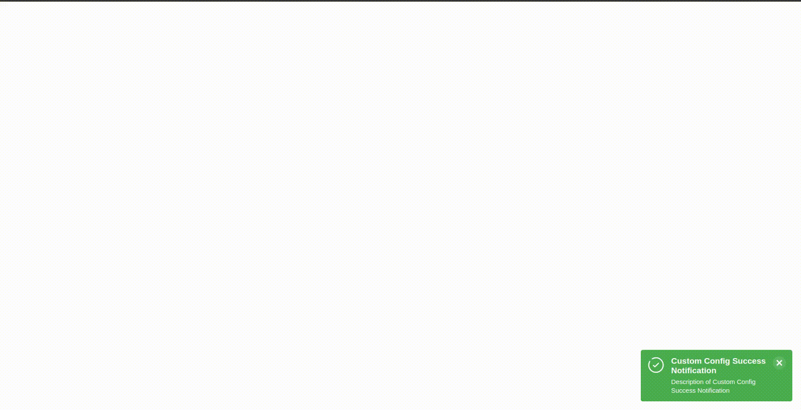
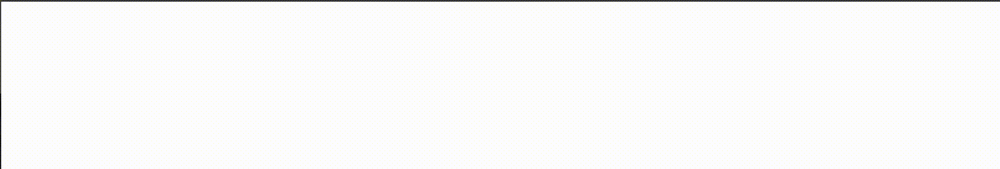

# vue3-notifier

## Examples

Some Example for vue3 notifier

### 1. Basic Usage


```ts
// main.ts
import 'vue3-notifier/style.css';

import { createApp } from 'vue';
import { useNotifierPlugin } from 'vue3-notifier';

import App from './App.vue';

createApp(App)
  .use(useNotifierPlugin())

  .mount('#app');
```

```vue
<!-- App.vue -->
<script lang="ts" setup>
import { useNotifier } from 'vue3-notifier';

const notifier = useNotifier();
notifier.notify({
  title: 'Basic Example',
  description: 'This is the most basic example',
});
</script>
```

### 2. Custom Config



```ts
// main.ts
import 'vue3-notifier/style.css';

import { createApp } from 'vue';
import { useNotifierPlugin } from 'vue3-notifier';

import App from './App.vue';

createApp(App)
  .use(
    useNotifierPlugin({
      id: 'custom',
      showProgressBar: true,
      timeout: 5_000,
      closable: false,
      pauseOnHover: false,
      maxNotifictions: 6,
    }),
  )

  .mount('#app');
```

```vue
<!-- App.vue -->
<script lang="ts" setup>
import { onMounted } from 'vue';
import { useNotifier } from 'vue3-notifier';

const delay = (ms = 500) => new Promise((res) => setTimeout(res, ms));

const notifier = useNotifier('custom');

onMounted(runDemo);
async function runDemo() {
  await delay();

  notifier.notify({
    title: 'Custom Config Basic Notification',
    description: 'Description of Custom Config Basic Notification',
  });

  notifier.notify({
    title: 'Custom Config Ifno Notification',
    description: 'Description of Custom Config Ifno Notification',
    type: 'info',
    closable: false,
  });

  await delay();

  notifier.notify({
    title: 'Custom Config Error Notification',
    description: 'Description of Custom Config Error Notification',
    type: 'error',
  });

  await delay();

  notifier.notify({
    title: 'Custom Config Warning Notification',
    description: 'Description of Custom Config Warning Notification',
    type: 'warning',
    showProgressBar: false,
  });

  await delay(1_000);

  notifier.notify({
    title: 'Custom Config Success Notification',
    description: 'Description of Custom Config Success Notification',
    type: 'success',
    persistent: true,
    closable: true,
  });
}
</script>
```

### 3. Multiple notifiers


```ts
// main.ts
import 'vue3-notifier/style.css';

import { createApp } from 'vue';
import { useNotifierPlugin } from 'vue3-notifier';

import App from './App.vue';

createApp(App)
  .use(
    useNotifierPlugin({
      id: 'right',
      position: 'bottom right',
    }),
  )
  .use(
    useNotifierPlugin({
      id: 'left',
      position: 'bottom left',
    }),
  )
  .use(
    useNotifierPlugin({
      id: 'top',
      position: 'top', // same as "top center"
    }),
  )

  .mount('#app');
```

```vue
<!-- App.vue -->
<script lang="ts" setup>
import { onMounted } from 'vue';
import { useNotifier } from 'vue3-notifier';

const delay = (ms = 500) => new Promise((res) => setTimeout(res, ms));

const notifierRight = useNotifier('right');
const notifierLeft = useNotifier('left');
const notifierTop = useNotifier('top');

onMounted(runDemo);
async function runDemo() {
  await delay();

  notifierRight.notify({
    title: 'This is notifier right',
    description: 'Notification #1 from notifierRight',
    showProgressBar: true,
    timeout: 7_000,
    type: 'info',
  });

  await delay();

  notifierLeft.notify({
    title: 'This is notifier left',
    description: 'Notification #2 from notifierLeft',
    showProgressBar: true,
    type: 'info',
  });

  await delay();

  notifierRight.notify({
    title: 'This is notifier right',
    description: 'Notification #3 from notifierRight',
    showProgressBar: true,
    type: 'warning',
  });

  await delay();

  notifierTop.notify({
    title: 'This is notifier top',
    description: 'Notification #3 from notifierTop',
    notificationStyles: {
      boxShadow: '0 0 16px red',
    },
  });

  await delay();

  notifierLeft.notify({
    title: 'This is notifier left',
    description: 'Notification #2 from notifierLeft',
    showProgressBar: true,
    type: 'error',
  });

  await delay();

  notifierTop.notify({
    title: 'This is notifier top',
    description: 'Notification #3 from notifierTop',
    type: 'success',
  });
}
</script>
```

### 4. Advanced Usage


```ts
// main.ts
import 'vue3-notifier/style.css';

import { createApp } from 'vue';
import { useNotifierPlugin } from 'vue3-notifier';

import App from './App.vue';

createApp(App)
  .use(
    useNotifierPlugin({
      persistent: true,
      maxNotifictions: 10,
    }),
  )

  .mount('#app');
```

```vue
<!-- App.vue -->
<script lang="ts" setup>
import { onMounted } from 'vue';
import { useNotifier, type NotifierOptions } from 'vue3-notifier';

const delay = (ms = 500) => new Promise((res) => setTimeout(res, ms));

const notifier = useNotifier();

onMounted(runDemo);
async function runDemo() {
  let [a, b, c, d, e] = await Promise.all(
    (<const>['default', 'error', 'info', 'warning', 'success']).map(async (type, index) =>
      delay(500 + 500 * index).then(() =>
        notifier.notify({
          title: `Notification #${index + 1}`,
          description: `Description for notification #${index}`,
          type,
        }),
      ),
    ),
  );

  await delay();

  notifier.updatePluginOptions({ position: 'top left' });

  await delay(1_000);

  a.destroy();

  await delay(750);

  a = notifier.notify({
    title: 'Notification from top left',
    description: 'This is example notification from top left',
    type: 'warning',
  });

  await delay();

  notifier.updatePluginOptions({ position: 'top right' });

  await delay(1_000);

  c.destroy();

  await delay(750);

  c = notifier.notify({
    showIcon: false,
    title: 'Notification from top right',
    description: 'This is example notification from top right',
    type: 'info',
  });

  await delay();

  notifier.updatePluginOptions({ position: 'top' });

  await delay(1_000);

  notifier.updatePluginOptions({ position: 'bottom left' });

  await delay(1_000);

  notifier.updatePluginOptions({ position: 'bottom' });

  await delay(1_000);

  notifier.updatePluginOptions({ position: 'center' });

  await delay(1_000);

  notifier.destroyAll();
}
</script>
```

### 5. Custom Components



```vue
<!-- CustomNotifiction.vue -->
<template>
  <div
    :style="{
      fontFamily: 'sans-serif',
      color: '#fff',
      backgroundColor: '#333',
      padding: '15px',
      display: 'flex',
      justifyContent: 'space-between',
      alignItems: 'center',
    }"
  >
    <div>
      <h5>{{ $props.notification.title }}</h5>
      <p>{{ $props.notification.description }}</p>
    </div>
    <button @click="$props.notification.destroy()">Close</button>
  </div>
</template>

<script lang="ts">
import { makeNotifierProps } from 'vue3-notifier';

export default {
  props: makeNotifierProps(),
};
</script>
```

```ts
// main.ts
import { createApp } from 'vue';
import { useNotifierPlugin } from 'vue3-notifier';

import App from './App.vue';
import CustomNotifiction from './component/CustomNotifiction.vue';

createApp(App)
  .use(
    useNotifierPlugin({
      component: CustomNotifiction,
    }),
  )

  .mount('#app');
```

```vue
<!-- App.vue -->
<script lang="ts" setup>
import { useNotifier } from 'vue3-notifier';

const notifier = useNotifier();

notifier.notify({
  title: 'Custom Notification',
  description: 'Awesome!!',
});
</script>
```

### 6. Vuetify Alert Example


```ts
// vuetify
// yarn install vuetify @mdi/font

import 'vuetify/styles';
import '@mdi/font/css/materialdesignicons.min.css';

import { createVuetify } from 'vuetify';
import * as components from 'vuetify/components';
import * as directives from 'vuetify/directives';

export const $vuetify = createVuetify({
  components,
  directives,
  theme: {
    defaultTheme: 'dark',
  },
});
```

```vue
<!-- CustomNotifiction.vue -->
<template>
  <v-alert
    :variant="variant"
    :icon="icon"
    :type="$props.notification.type === 'default' ? undefined : $props.notification.type"
  >
    <v-alert-title>{{ $props.notification.title }}</v-alert-title>
    <span>{{ $props.notification.description }}</span>
  </v-alert>
</template>

<script lang="ts">
import type { PropType } from 'vue';
import { computed } from 'vue';
import { makeNotifierProps } from 'vue3-notifier';

export default {
  props: {
    ...makeNotifierProps(),
    variant: String as PropType<undefined | 'tonal'>,
  },
  setup(props) {
    const icon = computed(() => (props.notification.type === 'default' ? 'mdi-bell-ring' : undefined));

    return { icon };
  },
};
</script>
```

```ts
// main.ts
import { createApp } from 'vue';
import { useNotifierPlugin } from 'vue3-notifier';

import App from './App.vue';
import { $vuetify } from '@/plugins/vuetify';
import CustomNotifiction from './component/CustomNotifiction.vue';

createApp(App)
  .use($vuetify)
  .use(
    useNotifierPlugin({
      component: CustomNotifiction,
      plugins: [$vuetify],
      maxNotifictions: 20,
    }),
  )

  .mount('#app');
```

```vue
<!-- App.vue -->
<script lang="ts" setup>
import { useNotifier } from 'vue3-notifier';
import { useTheme } from 'vuetify';

const notifier = useNotifier();
const theme = useTheme();

const types = [/* default */,  "info", "error", "warning", "success"] as const // prettier-ignore
const tonalTypes = ['info', 'error', 'success'];

for (const type of types) {
  notifier.notify({
    title: 'Custom Notification',
    description: 'Awesome!!',
    type,
    props: {
      variant: tonalTypes.includes(type as string) ? 'tonal' : undefined,
    },
  });
}

setTimeout(() => {
  theme.global.name.value = 'light';
}, 1000);

setTimeout(() => {
  theme.global.name.value = 'dark';
}, 2000);

setTimeout(() => {
  notifier.destroyAll();
}, 3000);
</script>
```
